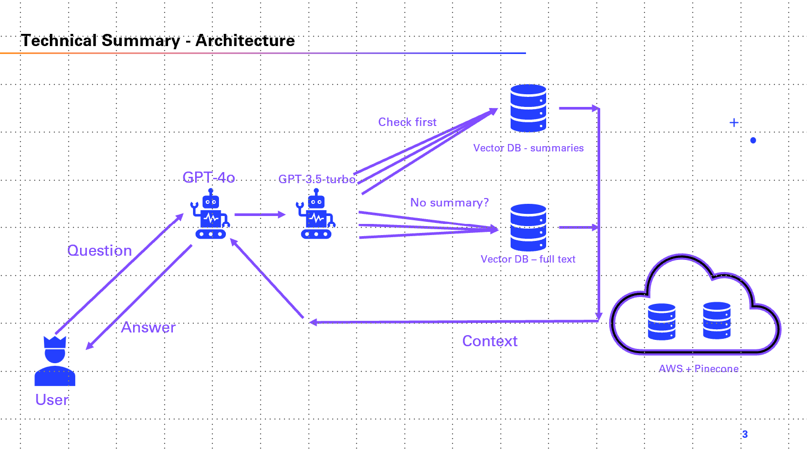

# Final Project of the AI engineering Bootcamp: Building a Multimodal AI ChatBot for YouTube Video QA

Introducing Rizzbot! Here to help you autistic nerds become charming. 

This is the final project of the 9 week AI engineering bootcamp, I did for Ironhack from 1 May to 4 July 2025. In this project, I built a chatbot that allows for natural language querying on a RAG Database of Youtube Videos. The videos come from the undisputed top-tier Youtube Channel about charisma: Charisma on Command. Users can ask charisma related questions, and the bot will answer based on information in the database only. 

### Project Overview

The goal of this final project is to develop a RAG system or AI bot that combines the power of text and audio processing to answer questions about YouTube videos. The bot will utilize natural language processing (NLP) techniques and speech recognition to analyze both textual and audio input, extract relevant information from YouTube videos, and provide accurate answers to user queries.

# Data collection and preprocessing
To collect the data for the RAG system, I used the yt-dlp library to download the audio of 179 videos. Then transcribed the audio to text via OpenAi's Whisper. The text is then chunked and embedded into a PineCone vector database.
Afterwards, I ran some unsupervised learning over the embedded collected text in order to find out what the most common semantic topics that are discussed in the dataset. For this, I used DBSCAN to create clusters, then applied BERTopic to assign semantic topic lables to each cluster. Cleaned up the clusters containing advertisements and then vectorized and saved these clusters to pinecone again. This left 41 clusters of the most common topics.
Finally, I used chatgpt to create summaries (of 1000 words each) of these most common topics, then embedded and saved these with relevant metadata tags for retrieval later on. These summaries will be used later in the final architecture to speed up processing as a caching system. 
Note that in the entire data collection and preprocessing pipeline, the data is only stored temporarily on my local memory for processing where necessary. Other than that, all data is stored and pulled from an AWS Bucket and PineCone Vector database. All temporarily stored data is deleted after use. This is to save memory from my local device, all is stored in the cloud. All vectors are stored in 1536 dimensions, so that they can be used by ChatGPT-4o in the final agentic architecture. 

# Agentic Chatbot architecture

To see the simplified architecture of the Rizzbot, refer to the diagram below. 

The simplified flow of the bot is as follows:
User input Question
   |
Main model (GPT-4o)
   |
Sends the Question to GPT-3.5-turbo for Multi-shot query
   |
Semantic search the summaries Pinecone DB
   |
Found? -> Yes? -> Use Summary for context + Main model-> Answer
   |
   No
   |
Semantic Search the full vector DB -> 
   |
Found? -> Yes? -> Main model generates summary from context -> Answer
   |
   No
   |
Answer: Sorry bro, I don't have enough information in my database to confidently answer.  

The agentic chain is built using LangChain. Additionally, LangSmith is incorporated to keep track of the chain. 
The main Tool used by the Agent is the RAG database. Because the point of the bot is to only answer based on information in the database, the instructions of the main model are tuned so that it is only allowed to answer if it can find enough relevant information in the database. 
Similarity threshold is set to 0.35, since anything higher means that for most questions the model cannot find any related documents. This is likely due to the fact that most topics and practical tips are spread out in a dispersed manner over multiple documents. 
The Rizzbot considers enough documents about the user questions found when it has found >= 2 relevant documents. This can be adjusted at your leisure. 

# Documents and their uses
Shiva.ipynb - Dedicated notebook to delete and create pinecone indexes. Because I had to redo (the summaries in particular) a lot of pinecone index saving, I dedicated a notebook specifically to deleting and creating pinecone indexes to save time. Named after Shiva from Hinduism, who is both creator and destroyer. 

rizzbot_agentic.py - Contains the working version of the agentic rizzbot system. Rizzbot is written as a class, so that it can be imported for Gradio deployment. Receives a user question, multi-shot-queries the question, checks the pinecone databases (summaries and full text) for relevant data, then summarizes an answer if it finds this in the database. 

gradio_app.py - The Gradio wrapper to deploy rizzbot. It loads the Rizzbot Class from rizzbot_agentic.py, and deploys it in a simple webpage. 

Folder - Clustering - contains the draft and final jupyter notebook used to create clusters of the vectors using DBSCAN. It then uses BERTopic to assign topics to the created clusters. The last cell cleans out the clusters that contain mostly advertisements. The cleaned clusters + vectors are stored in a .pkl file for later use.

Folder - Evaluation - Contains the output of the latest versions of Rizzbot for review. Also contains the notebook Rizzbot_v3 - Agentic-testing+eval which contains the deployed version of the Rizzbot and in the last cell contains an llm evaluation system. This is a simple script that runs ChatGPT-4o over the outputs of Rizzbot and scores them on various metrics. 

Folder - Preprocessing - contains the drafts and final jupyter notebook used to download YT video audio, convert to text and vectorize the text.

Folder - Pre-summarization - contains the drafts and final jupyter notebooks used to generate summaries of the cleaned clusters pkl. Careful with using V2, there is a recursive function in there that will generate 129k summaries when you run this notebook. The script uses gpt-4o-mini to generate the summaries. All summaries are vectorized and stored with meaningful metadata in the Pinecone database called 'rizzbot-summaries'. 

Folder - Presentation - contains the Powerpoint presentation that was given at the final day of the Bootcamp.

Folder - Rizzbot_setup - contains the drafts that set up and initialize the agentic rizzbot system. The notebooks are used to test various iterations of the system. The notebook Rizzbot_v3 - Agentic-testing+eval contains the deployed version of the Rizzbot.  

